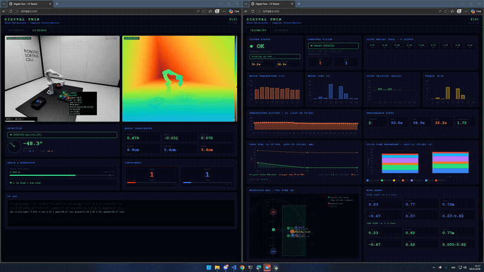
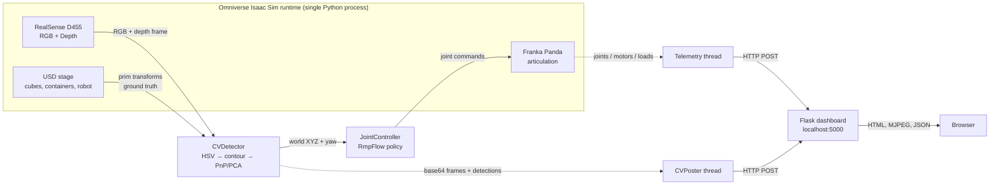

# twin-sync-sorter

[](https://github.com/Dreamzy4/twin-sync-sorter/actions/workflows/ci.yml)
[](LICENSE)
[](https://www.python.org)
[](https://www.nvidia.com/omniverse)

Closed-loop computer-vision pickup demo on a **Franka Panda digital twin** in **NVIDIA Omniverse Isaac Sim**. The robot detects coloured cubes through a simulated RealSense D455, picks each one up with RmpFlow motion planning, and sorts it into a colour-matched container - while a Flask dashboard streams live RGB / depth, joint telemetry, and a per-cycle **twin-sync metric** comparing CV detections against USD ground truth.

`Omniverse Isaac Sim` | `OpenUSD / pxr` | `PhysX 5` | `RTX` | `RmpFlow` | `OpenCV` | `Flask` | `Chart.js`

## Demo

The two clips below are **independent recordings from different sort cycles** - the first is a viewport / dashboard split during a pickup, the second focuses on the dashboard tabs. For an end-to-end view of one continuous run, see the YouTube link.




Longer capture on YouTube: [full sorting run](https://youtu.be/M6AdsoH_tKc).

## Requirements

| Component | Minimum / required |
|---|---|
| OS | Windows 10/11 or Ubuntu 20.04/22.04 |
| GPU | NVIDIA RTX (Turing or newer); 8 GB VRAM recommended for path-tracing |
| RAM | 16 GB minimum, 32 GB recommended |
| Disk | ~50 GB free (Isaac Sim install + asset caches) |
| Python | 3.10+ (Isaac Sim ships its own 3.10 interpreter; standalone tooling uses the same) |
| Omniverse Isaac Sim | 2023.1.x - built against the `omni.isaac.*` API namespace (see [Limitations](#limitations) re: Isaac 4.x rename) |
| Python packages | `flask>=3.0,<4.0`, `numpy>=1.24,<2.0`, `opencv-python>=4.8`, `requests>=2.31` - declared in [pyproject.toml](pyproject.toml) |
| Dev extras (optional) | `pytest`, `pytest-cov`, `ruff` - install via `pip install -e ".[dev]"` |

Isaac Sim / Omniverse modules (`omni.isaac.*`, `pxr`) come from the Isaac Sim Python environment and are **not** pip-installable - install Isaac Sim from the Omniverse Launcher first, then register this repo on `PYTHONPATH` (see [Run](#run)).

## Quick start

Windows examples below; Linux is symmetric - run the equivalent shell commands.

```powershell
git clone https://github.com/<you>/twin-sync-sorter.git
cd twin-sync-sorter
.\setup.ps1
```

[setup.ps1](setup.ps1) installs the Python dependencies and registers the repo on your user `PYTHONPATH` so Isaac's Script Editor can `import robot_motion` with no path boilerplate. Restart Isaac Sim afterwards so the new env var is picked up.

Then:

1. **In Isaac Sim**: `File -> Open` -> `<path-to-repo>/assets/robot_cv_scene.usd` -> press **Play**.
2. **In a separate terminal** (any directory): `python dashboard_server.py` -> open <http://localhost:5000>.
3. **In Isaac's Script Editor**:
   ```python
   import robot_motion; robot_motion.main()
   ```

That's the whole launch. The orchestrator drives the sort cycle, the dashboard streams telemetry, and the Twin-Sync chart tracks Δ CV-USD live. See [Run](#run) for what `setup.ps1` actually does and the variants (no PYTHONPATH, ad-hoc `sys.path`, etc.); see [Limitations](#limitations) for hardware / API caveats.

## Omniverse stack

Built on **NVIDIA Omniverse**:

| Layer | This project |
|---|---|
| Runtime | Omniverse Isaac Sim 2023.1+ (Kit-based application) |
| Data fabric | OpenUSD - single scene (`assets/robot_cv_scene.usd`) is source of truth for sim, render, and twin validation |
| Physics | Omniverse PhysX 5 |
| Rendering | Hydra delegate with RTX path-tracing |
| Robot model | Franka Panda articulation (USD prim with PhysX schema) |
| Sensor | RealSense D455 RGB + depth (`omni.isaac.sensor`) |
| Motion planning | RmpFlow (`omni.isaac.motion_generation`) |
| Python API | `omni.isaac.core`, `omni.isaac.sensor`, `pxr` (USD) |

The single USD stage is what makes this a digital twin rather than a script: `pxr.Usd` queries return ground-truth prim transforms, the CV pipeline runs on Hydra-rendered camera output, and per-cycle twin validation closes the loop between the two.

## Sample run

Numbers below are a snapshot from **one** demo session (n=1, scripted scene with 3 RED + 3 BLUE pickup cubes). They are not a benchmark suite and they are not averaged across hardware / lighting / seed; treat them as one observation, not a statistical claim. The live dashboard view is captured in [docs/dashboard_demo.gif](docs/dashboard_demo.gif).

| Metric | Value |
|---|---|
| Successful pickups | 6 / 6 |
| Total cycles | 7 (6 pickups + 1 empty-zone retry) |
| Mean cycle time | 34.2 s (min 31.1 / max 35.4) |
| Throughput | 1.76 cubes / min |
| Twin-Sync Δ_pre mean (raw CV vs USD, no correction) | 26.2 mm |
| Twin-Sync Δ_post mean (after EMA bias correction) | 4.4 mm |
| Cycles in degraded zone (Δ_post > 10 mm) | 1 / 6 |

> Δ_pre is the perception-quality figure - CV's raw projection error against ground truth, no fitting of any kind. Δ_post is a *convergence* indicator: the EMA bias is fitted against the same USD coordinates Δ_post is measured against, so it shrinks by construction. Any "4 mm CV accuracy" framing would be misleading; the honest characterisation is "raw projection drifts ~26 mm against USD; the per-cycle EMA reduces residual to ~4 mm but does not measure intrinsic CV accuracy". Cycle time is dominated by deliberate motion-policy throttling (`dt = 1/35 s` normal, `1/18 s` fast, `1/8 s` aggressive transit) and would change linearly with that knob - it is not an ML inference cost.

## Architecture



The Isaac runtime and the dashboard are **separate processes** linked over HTTP, so the dashboard stays responsive even when Isaac is paused or stepping slowly.

## Twin validation (Δ CV-USD)

The defining feature of this demo isn't pick-and-place - it's that **every detection is scored against USD ground truth in real time**. For each cube:

1. CV pipeline produces a world XYZ via `pixel -> depth -> intrinsics -> cam-to-world` projection.
2. `_match_usd_prim` finds the nearest tracked cube prim within `USD_MATCH_MAX_DISTANCE` (25 cm).
3. **Two** Twin-Sync deltas are reported per cycle:
   - `Δ_pre = ||raw_CV_xyz - USD_xyz||` - raw projection error, **no bias correction applied**. This is the honest perception-quality figure: it cannot converge by construction because nothing fits CV against USD.
   - `Δ_post = ||CV_xyz - USD_xyz||` - residual after the EMA bias correction. Convergence indicator only - the bias is fitted against the same USD coordinates Δ_post is measured against, so it shrinks by construction.

   The sample run reports Δ_pre ≈ 26 mm (raw CV) and Δ_post ≈ 4 mm (after EMA). Both numbers are logged per cycle:

   ```
   [Target] RED Cube_17 px=(319,326) xyz=(0.377,-0.054,0.078) yaw=+0°(cv) Δ_pre=28.2 Δ_post=8.3mm
   ```
4. The CV-to-world bias (`scene_config.CV_WORLD_BIAS`) is **EMA-updated** each cycle from the matched USD prim, with the per-step correction clipped to ±2 cm. The ±5 cm absolute clamp on the cumulative bias is a guard against single-frame outliers, not against the typical-case error - in normal operation `Δ_pre` stays well under the clamp.
5. When CV yaw confidence is low (`|CV - USD| > USD_YAW_TOLERANCE`), grasping falls back to USD-derived yaw - robust to motion-blur or partial occlusion frames.

The dashboard plots both series (solid green = `Δ_post`, dashed orange = `Δ_pre`) so the gap between raw perception and corrected estimate stays visible across the whole run, not just summarized as a single number.

This turns the project from "scripted demo" into a small **online-calibration loop** - the twin validates the perception, and the perception trusts the twin only when it disagrees beyond a tolerance.

## Run

Two processes on the same machine.

### Install

```powershell
pip install -e .              # runtime (flask, opencv-python, numpy, requests)
pip install -e ".[dev]"       # + pytest, pytest-cov, ruff for tests / linting
```

Isaac Sim / Omniverse modules (`omni.isaac.*`, `pxr`) come from the Isaac Sim Python environment and are not pip-installable.

### Dashboard

```powershell
python dashboard_server.py
```

Open <http://localhost:5000>.

### Isaac runtime

**One-time setup** (no admin, no install ceremony):

```powershell
[System.Environment]::SetEnvironmentVariable('PYTHONPATH', '<path-to-repo>', 'User')
```

This writes one entry to the Windows user registry; Python reads it on every startup and adds `<path-to-repo>` to `sys.path`. After **restarting Isaac** so the new env var is picked up, the Script Editor launch line is path-free:

```python
import robot_motion; robot_motion.main()
```

That is the whole launch. Source edits inside the cloned repo are picked up on the **next Isaac process** - Python caches imports per process, so a second `import robot_motion` in the same Script Editor session re-uses the version already in memory.

**Iterating on the code without restarting Isaac** (handy when you are actively editing modules and want to see changes immediately): pop the cached entries from `sys.modules` before the import so Python re-reads from disk.

```python
import sys
for m in ("robot_motion", "cv_detector", "joint_control", "telemetry", "async_logger", "scene_config"):
    sys.modules.pop(m, None)
import robot_motion; robot_motion.main()
```

To undo:

```powershell
[System.Environment]::SetEnvironmentVariable('PYTHONPATH', $null, 'User')
```

**Alternative: ad-hoc launch without setting PYTHONPATH.** Paste a longer one-liner that wires up `sys.path` per launch:

```python
import sys; sys.path.insert(0, r"<path-to-repo>"); import robot_motion; robot_motion.main()
```

**Alternative: pip install -e .** if the Isaac Python interpreter lives in a user-writable directory (`import sys; print(sys.executable)` from inside Isaac to check). Some Isaac installs sit under `C:\Windows\System32\` and require admin to write to `site-packages`; PYTHONPATH avoids that entirely.

### Tests

```powershell
pytest tests/ -v
```

### Verbose mode

Default output is concise (~5 lines per cycle). For step-level traces:

```powershell
$env:DTCV_VERBOSE = "1"
```

To disable async stdout (debugging an Isaac hang):

```powershell
$env:DTCV_SYNC_PRINT = "1"
```

## Project layout

| File | Role |
|---|---|
| [robot_motion.py](robot_motion.py) | Main loop: search -> pick -> place cycle, telemetry dispatch, bias EMA |
| [cv_detector.py](cv_detector.py) | HSV detection, depth projection, USD ground-truth fallback |
| [joint_control.py](joint_control.py) | RmpFlow wrapper, dual-Z workspace clamping, gripper, pick-and-place phases |
| [telemetry.py](telemetry.py) | Daemon-thread pushers to dashboard (`Telemetry`, `CVPoster`) |
| [dashboard_server.py](dashboard_server.py) | Flask server: REST + MJPEG streams, overlay rendering |
| [scene_config.py](scene_config.py) | Single source of truth for scene-specific constants (camera prims, workspace, containers, USD fallback tuning) |
| [async_logger.py](async_logger.py) | Non-blocking `print()` replacement to keep Isaac sim-step latency bounded |

## Configuration

All scene-dependent values are in [scene_config.py](scene_config.py): camera prim paths, pickup colours, workspace bounds, container coordinates, USD-fallback tolerances. Porting to a new Isaac scene only requires editing this file - every other module imports from it.

## Engineering notes

- **Async print** - Isaac's stdout flush can stall `world.step()` from CV/motion/telemetry threads. [async_logger.py](async_logger.py) installs a queue-backed writer (4096-deep, drops on overflow with shutdown report) that keeps `print()` non-blocking.
- **Dual-Z workspace** - RmpFlow's reach envelope tightens at high Z (transit) compared to table level (pick / place), so [joint_control.py](joint_control.py) carries two `WorkspaceConstraints` profiles (`WORKSPACE_HIGH` / `WORKSPACE_LOW`) and selects per phase to keep targets inside whichever envelope applies.
- **Bias EMA with bounds** - per-cycle CV-to-world bias correction is clipped to ±2 cm/step and ±5 cm absolute to absorb single-frame outliers without drift.
- **Hysteresis on warnings** - motor overheat / overload thresholds use separate enter/exit bands (`58 -> 60 °C`, `cool_n=2`) so dashboard badges don't flicker on the threshold.
- **Page Visibility API** - the browser dashboard halts polling when the tab is backgrounded so an idle laptop doesn't keep hammering the Flask process.

## Testing

```powershell
pytest tests/ -v
```

51 tests, ~30 % coverage. Tested-vs-untested split is intentional and worth being explicit about:

| Module | Coverage | What is / isn't tested |
|---|---|---|
| `scene_config.py` | 100 % | Geometric invariants: pickup zone subset of workspace, containers outside zone, dual-Z probe ordering, bias bounds. |
| `async_logger.py` | 92 % | Install / shutdown idempotency, queue overflow drop counter, non-stdout passthrough, `DTCV_SYNC_PRINT` bypass. |
| `dashboard_server.py` | 47 % | REST contract: `/api/cv/config`, `/api/cv/update` twin-sync ingest, `/api/cv` snapshot, `/api/cv/clear-history` (incl. orchestrator-reset signal), telemetry round-trip. Render thread, MJPEG encoding and OpenCV overlays are not exercised. |
| `telemetry.py` | 20 % | Hysteresis state machine for overheat / overload (3-on, 2-off, counter reset). Live sampling and HTTP push are not exercised. |
| `cv_detector.py` | 10 % | Pure helpers: `_order_quad_points`, `_normalize_yaw_*`, `COLOR_RANGES` invariants. The detection pipeline itself needs a running Isaac stage and is verified by manually running [robot_motion.py](robot_motion.py). |
| `joint_control.py` | 14 % | `WorkspaceConstraints.clamp` and `DualWorkspace` selection. RmpFlow integration is verified manually. |
| `robot_motion.py` | 11 % | Module-level constants and import-time wiring; the orchestration loop itself runs only inside Isaac. |

The CI lint (`ruff` with `E,F,I,B,UP`) and the import smoke test (`tests/test_imports.py`) guarantee that every module loads in a pure-Python environment - so a contributor can add a unit test without spinning up Isaac, and a green CI is a real signal, not just a badge.

## Limitations

Honest list of trade-offs and known weak spots, so a reviewer doesn't have to dig them out:

- **Single-run numbers in [Sample run](#sample-run)**. n=1, single seed, single hardware host, scripted scene. Not a benchmark suite. Treat the figures as one observation; a multi-seed sweep across lighting / poses is out of scope for this demo.
- **Legacy `omni.isaac.*` namespace**. Built against Isaac Sim 2023.1 / 4.0 API (`omni.isaac.core`, `omni.isaac.motion_generation`, `omni.isaac.sensor`). Isaac Sim 4.x renamed those modules to `isaacsim.*`; migrating is a separate effort and out of scope for this portfolio demo.
- **Twin-Sync Δ_post is a convergence indicator, not raw accuracy**. The EMA bias is fitted against the same USD coordinates that Δ_post measures against, so it shrinks by construction. The raw perception figure is Δ_pre - see the [Sample run](#sample-run) table and the [Twin validation](#twin-validation-δ-cv-usd) section.
- **Cycle time is policy-throttled**. The motion-policy `dt` (`1/35` / `1/18` / `1/8` s for normal / fast / aggressive) is set conservatively for visual demo legibility; a production tuning would shrink cycle time linearly with that knob.
- **Module-level globals in [robot_motion.py](robot_motion.py)**. The orchestrator keeps simulation state (`world`, `robot`, `cv`, `ctl`, `tel`, `CV_STATE`, processed-target memos) as module-level names rather than wrapping them in a `Runtime` dataclass passed through every helper signature. The trade-off saves verbosity in the cycle helpers; the cost is that the memos would leak between runs. Two safety nets soften it: `main_loop()` calls `_reset_runtime_state()` at its start so a fresh `import robot_motion; robot_motion.main()` always begins clean, and a `reset_requested` flag piggy-backed on the dashboard's CLEAR button reaches the orchestrator on the next `/api/cv/update` round-trip and triggers the same reset mid-cycle.
- **God-class footprint in the three big files**. `robot_motion.py` (~1300 LOC), `cv_detector.py` (~1100 LOC), and `joint_control.py` (~1100 LOC) each carry one large class plus glue. Decomposition into pipeline-stage submodules (cv/segmentation, cv/projection, motion/workspace, motion/gripper, ...) is a natural next step once the demo scope grows; not done here because the regression risk on the 6/6 pickup flow is high and the value for a static demo is low.
- **Direct access to Isaac's `_articulation_view`** in [joint_control.py](joint_control.py) (twice, in gripper-state probes). The public `Articulation` API does not expose joint positions during a `step()`; the `_articulation_view` underscore-name is the path used by Isaac's own examples. Will need updating with the `isaacsim.*` migration above.
- **Hot-path code paths covered manually, not by unit tests**. `pick_and_place`, `pixel_to_world`, `apply_usd_yaw_fallback`, `recalibrate_bias` are validated by running the actual sort cycle in Isaac and watching the dashboard; they are not reachable from a Python-only test environment without a simulator stand-in. The [Testing](#testing) table lists what is and isn't covered.
- **`asyncio.get_event_loop()` in `main()`** is technically deprecated since Python 3.10. It is kept because Isaac's Script Editor already runs an event loop and `asyncio.run()` would fail there with `RuntimeError`; the `try / except RuntimeError` fallback handles the script-from-CLI case.
